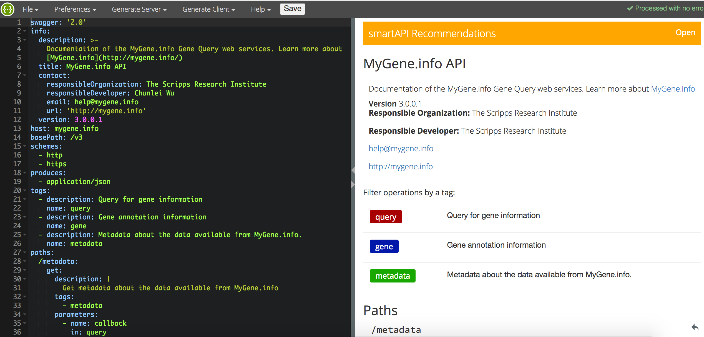

# smartAPI Editor: A tool for semantic annotation of Web APIs
# an extension to [Swagger Editor] (https://github.com/swagger-api/swagger-editor/releases)


smartAPI Editor is an an extension to [Swagger Editor] (https://github.com/swagger-api/swagger-editor/releases). Swagger Editor lets you edit your API document in in YAML inside your browser and to preview documentations in real time. 

smartAPI editor:
 validates your API document against [smartAPI specifications](https://github.com/WebsmartAPI/swagger-editor/blob/master/node_modules_changes/schema.json), an extended version of openAPI specification. 

**[LIVE DEMO](https://www.youtube.com/watch?v=EQpUEiOu1ng&t=2s)**

[]()


#### Running Locally

[**Download the code**](https://github.com/WebsmartAPI/swagger-editor/archive/master.zip) and serve the static files via your HTTP server. If you don't have an HTTP server, you can use [`http-server`](https://www.npmjs.com/package/http-server) Node.js module.


#### Building From Source

Make sure you have [Node.js](http://nodejs.org/) installed. 
Running the editor:

```shell
git clone https://github.com/WebsmartAPI/swagger-editor.git
cd swagger-editor
npm install
chmod 755 scripts/nmchange.sh
./scripts/nmchange.sh
npm start
```
Running elasticsearch
```shell
./elasticsearch
```

Running the Identifiers API ( an elasticsearch-based tornado app providing the identifiers from identifiers.org indexed using their names,synonyms, description, and URL)
```shell
cd identifiers
make index
make backend
```
#### Documentations
* [Importing your Swagger document](./docs/import.md)
* [Development Guide](./docs/development.md)
* [Configuration Guide](./docs/config.md)
* [Cross Origin Request(CORS) issues](docs/cors.md)

[Contributing](./CONTRIBUTING.md)

[LICENSE](./LICENSE)

---

